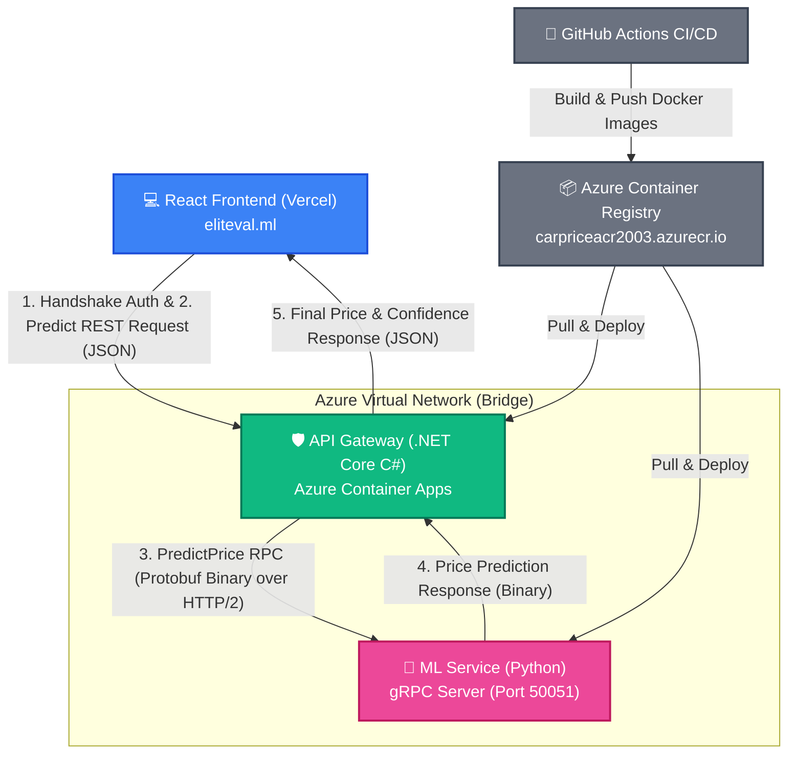

# 🚗 EliteVal — AI-Powered Car Price Prediction Engine (ELITEVAL.ML)

EliteVal is a highly optimized, production-grade polyglot microservice application designed to predict second-hand automobile market values. Combining an **83.3% precision Machine Learning model** with high-performance services, EliteVal delivers lightning-fast, mathematically sound automobile valuations in seconds.

The application leverages a modern microservice architecture, utilizing **Python** for machine learning execution, **.NET Core C#** as a robust, resilient API Gateway, and **React (TypeScript)** for a stunning, responsive, glassmorphic user interface. The communication between backend microservices is powered by **gRPC** for maximum speed and minimal latency.

Live Frontend: **[eliteval.ml](https://car-price-microservices-aye5.vercel.app)** *(Currently routed to the Vercel staging deployment)*  
---

## 📐 Microservices Architecture Diagram

To achieve high scalability, clean separation of concerns, and ultra-low latency, the project is structured as a polyglot microservice system.



---

## 🎯 Why We Built EliteVal

We designed and built EliteVal to address two core challenges: one business-focused and one highly technical.

### 1. Solving Second-Hand Market Pricing Asymmetry (The Business Goal)
Determining a fair price for a used vehicle is notoriously complex. Buyers and sellers traditionally rely on guesswork, subjective reports, or static lookup sheets that ignore critical features. 
- **EliteVal** removes the guesswork by analyzing 57 comprehensive automotive parameters (from basic dimensional layout to engine configurations and real-world efficiency) to generate a mathematically sound market estimate.
- By utilizing a **Linear Regression** model with an R² score of **83.3%** trained on clean automotive dataset, we provide both transparent pricing and a statistical model confidence score based on the input parameters.

### 2. Engineering a Polyglot, High-Performance Microservice Cloud System (The Technical Goal)
Rather than building a standard monolithic web application, we used this project as a playground to implement enterprise-grade software architecture patterns:
* **The Power of Polyglot Programming:** We combined the strengths of the two best-suited ecosystems for their respective jobs:
  * **Python** (for ML modeling, data preprocessing with `pandas`, and rapid machine learning execution via `scikit-learn` and `joblib`).
  * **.NET Core C#** (for building a highly secure, performant, multi-threaded, and highly structured API Gateway).
  * **React (TypeScript)** (for a modular, type-safe, and visually striking client interface).
* **gRPC Over Traditional REST/JSON:** Communication between the C# Gateway and the Python ML service is handled via **gRPC (gRPC Remote Procedure Call)**. Since standard JSON payloads are textual and verbose, serializing 57-field models introduces performance overhead. By using gRPC and **Protocol Buffers (Protobuf)**, we serialize structured data into a compact binary format sent over HTTP/2, reducing network bandwidth, eliminating serialization latency, and ensuring high-speed internal calls.
* **Gateway Security & Anti-Bot Handshake:** To prevent unauthorized consumption of our ML endpoints, we implemented a custom API Key security flow:
  1. The client first performs a secure GET `/Auth/handshake` request to the C# gateway.
  2. The gateway issues a temporary handshake token.
  3. The client must supply this token in the `X-ApiKey` header of the `/Prediction/predict` POST request, which is validated by C# middleware.
* **Polly-Powered Resilience & Fault Tolerance:** Microservices can experience intermittent network failures. We integrated **Polly** inside the .NET container to wrap gRPC requests with a robust resilience policy: a timeout policy (canceling requests exceeding 2 seconds) and a retry policy (automatically retrying failed calls 2 times with a 500ms delay).
* **Caching & Rate Limiting:** 
  * **Memory Cache:** Repeated predictions with identical features are cached instantly in the Gateway memory to bypass gRPC calls entirely.
  * **Rate Limiter:** Built-in fixed-window rate limiting restricts client IPs to a maximum of 10 requests per minute to protect the microservices from DDoS or denial-of-service exploits.

---

## 🌐 Why We Put the Custom Domain (`ELITEVAL.ML`)

Deploying a complex, multi-service machine learning system is only half the battle; presenting it to the world professionally is the other half. We acquired and configured the domain **ELITEVAL.ML** (Elite Valuations ML) for several key reasons:

1. **Professional Identity & Branding:** Standard cloud deployment subdomains (like `*.vercel.app` or `*.azurecontainerapps.io`) are lengthy, unmemorable, and signal a student/hobby project. **ELITEVAL.ML** instantly communicates a premium, commercial-grade AI utility designed for elite automobile analytics.
2. **User Accessibility & Trust:** A custom domain builds immediate credibility and brand trust. For users looking to estimate real asset values (cars worth thousands of dollars), interacting with a custom-branded domain ensures they feel secure and trust the model outputs.
3. **Decoupled Infrastructure Routing:** The custom domain acts as a clean facade. Under the hood, we route the React frontend to Vercel's global CDN edge networks, and direct API endpoints to Microsoft's scalable Azure Container Apps. If we decide to migrate our hosting (e.g., from Azure to AWS, or from Vercel to self-hosted cloud VMs), we can update our DNS records seamlessly without ever changing a single line of client-side configuration.

---

## 🛠️ System Components Detail

### 1. The Machine Learning Microservice (Python)
- **Model Type:** Scikit-Learn `LinearRegression` trained on the `automobile.csv` dataset.
- **Service Type:** gRPC Server listening on port `50051`.
- **Preprocessors:** One-hot encoding on 22 automotive manufacturers, 6 engine layouts, and 7 cylinder types. Min-Max normalization for engine sizes and weights.
- **Key Scripts:**
  - `train_and_save.py`: Script to train the regression model, generate statistical metrics, and dump serialize files (`car_model.pkl` and `model_columns.pkl`) using `joblib`.
  - `grpc_server.py`: Runs a Python gRPC server, accepts incoming `PredictPrice` requests, maps the protobuf fields to a pandas DataFrame, re-indexes column alignments (preventing out-of-order feature bugs), executes model predictions, and returns binary results.

### 2. The API Gateway (.NET Core C#)
- **Role:** Secure reverse proxy and orchestrator. Exposed as a REST API to the public internet while communicating privately with Python over gRPC.
- **Key Middleware & Classes:**
  - `Program.cs`: Configures the ASP.NET pipeline, CORS policies, Polly retry wrappers, in-memory caching, gRPC client dependencies, and fixed-window rate limiters.
  - `ApiKeyMiddleware`: Rejects incoming REST prediction requests if they lack a valid temporary token from the handshake controller.
  - `ExceptionMiddleware`: Captures backend exceptions globally and formats a clean, standardized JSON response to prevent exposing server stack traces.
  - `CarPredictionService`: Integrates the gRPC client, manages Polly execution policies, and wraps prediction requests.

### 3. The Interactive UI (React + TypeScript)
- **Design Philosophy:** Rich, high-fidelity dark-mode user interface designed with modern CSS transitions, glassmorphic panels, and animated elements.
- **Key Features:**
  - **Premium Showcase Cards:** Displays benchmarks of popular real-world car valuations (Mercedes S-Class, Porsche 911 Carrera, Tesla Model S, etc.).
  - **Dynamic Accordion Inputs:** Split into 3 logical steps (*Core Configuration*, *Engine Performance*, and *Dimensions & Efficiency*) to simplify the input of 57 variables.
  - **Auto-Calculated Confidence Indicator:** Dynamically displays prediction confidence based on engine outputs.
  - **Validation Note Trigger:** Transparently warns users about model limitations (best performance is between **$5,000 and $35,000** due to mid-range dataset bias).

---

## 🚀 Deployment & CI/CD Pipeline

The project utilizes automated pipelines to ensure continuous integration and deployment.

- **GitHub Actions Workflow (`deploy.yml`):**
  - Triggered automatically on pushes to the `main` branch.
  - Logs into the **Azure Container Registry (ACR)** (`carpriceacr2003.azurecr.io`).
  - Builds optimized Dockerfiles for both services:
    - ML Service Dockerfile: [MicroServiceCarPricePrediction/MicroServiceCarPricePrediction/DockerFile](file:///c:/Users/RoYaA/Pictures/Pictures/API/MicroService/MicroServiceCarPricePrediction/MicroServiceCarPricePrediction/DockerFile)
    - C# API Service Dockerfile: [CarPricePredictor/CarPricePredictor/Docker/DockerFile](file:///c:/Users/RoYaA/Pictures/Pictures/API/MicroService/CarPricePredictor/CarPricePredictor/Docker/DockerFile)
  - Pushes images (`api-service:latest` and `ml-service:latest`) to the registry.
- **Staging / Production Environments:**
  - Backend containers are hosted as an application inside **Azure Container Apps (ACA)** in the `germanywestcentral` region.
  - The React frontend is deployed and served globally via **Vercel**.

---

## 💻 Running the Project Locally

### Prerequisites
- [Docker & Docker Compose](https://www.docker.com/) installed.
- (Optional for manual execution) .NET 9.0 SDK, Python 3.10+, Node.js 18+.

### Method 1: Using Docker Compose (Recommended)
You can launch the entire backend environment locally with a single command. Docker Compose will set up both containers inside a private bridge network and expose the .NET Gateway on port `80`:

1. Open your terminal in the root directory.
2. Build and start the services:
   ```bash
   docker-compose up --build
   ```
3. The API Gateway will be available at `http://localhost`. The Python ML Service will run privately on port `50051`.

### Method 2: Running Services Separately
If you want to run services manually for debugging:

1. **Python ML gRPC Server:**
   ```bash
   cd MicroServiceCarPricePrediction/MicroServiceCarPricePrediction
   pip install -r requirements.txt
   python grpc_server.py
   ```
2. **C# API Gateway:**
   ```bash
   cd CarPricePredictor/CarPricePredictor
   dotnet restore
   dotnet run
   ```
3. **React Frontend:**
   ```bash
   cd frontend
   npm install
   npm run dev
   ```

---

## 👥 The EliteVal Development Team

EliteVal was proudly engineered by a dedicated two-member developer team:

* **Zyad Refaat** (Machine Learning Engineer)
  - *Responsibilities:* Data preprocessing, feature engineering, ML model training, evaluation metrics, gRPC service design, and Python server scripting.
  - *LinkedIn:* [zyad-refaat](https://www.linkedin.com/in/zyad-refaat)
  - *GitHub:* [@zyadrefaat2023-gif](https://github.com/zyadrefaat2023-gif)
  - *Email:* zyadrefaat2023@gmail.com

* **Mohamed Talaat** (Software Engineer)
  - *Responsibilities:* API Gateway architecture, security middleware implementation, Polly resilience, memory caching, React frontend styling, Docker containerization, Azure/Vercel deployment, and DNS routing.
  - *LinkedIn:* [mohamed-talaat-](https://www.linkedin.com/in/mohamed-talaat-)
  - *GitHub:* [@mohamedtalaat2003](https://github.com/mohamedtalaat2003)
  - *Email:* mohamedtalattt5@gmail.com

---
*Developed with ❤️ by the EliteVal Team. For questions or collaboration, please reach out via our contact links above!*
